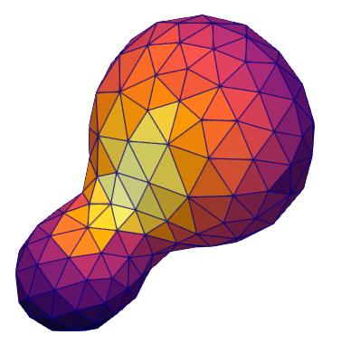
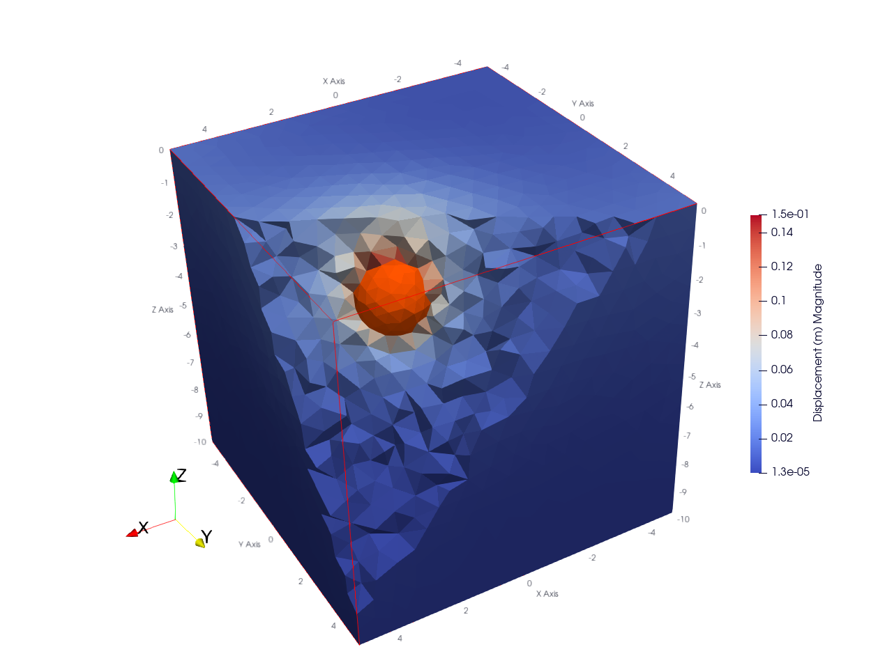
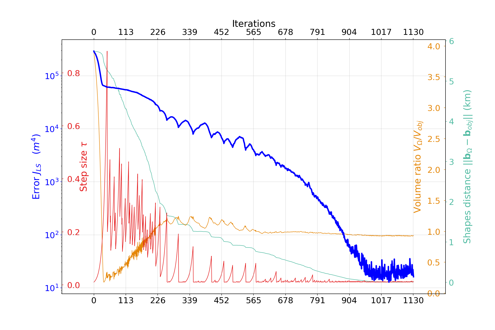
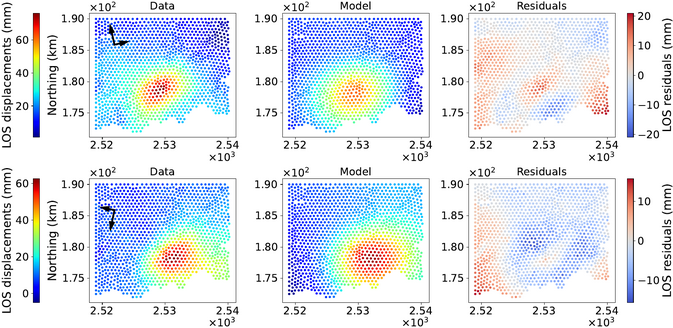

# magmaOpt


[](https://doi.org/10.5281/zenodo.17697386)


Shape optimization code to infer the shape of ground deformation sources in volcanic area.


---


## Quick Overview

> **Note**: This code is in early development stage. If you encounter bugs or would like to contribute, please email me at [theo.perrot@ens-paris-saclay.fr](mailto:theo.perrot@ens-paris-saclay.fr)

This project is forked from [sotuto shape optimization code](https://github.com/dapogny/sotuto)
but has been significantly modified and extended for this specific application. It is released alongside an article (in submission process, preprint available here) providing explanation of the method and demonstrate on synthetic and real test cases.


**A short tutorial** on how to use the code and tune its main parameters is available in [**tutorial.md**](tutorial.md).


## Example Outputs


**3D Visualization of the shape and the domain (Paraview)**




**Optimization Progress**




**Data / Model comparison for real data**




---


## Installation Instructions

### 1️. Get the Code
Clone this repository and navigate to the project directory:
```bash
git clone https://github.com/Th2ooo/magmaOpt
cd magmaOpt
```

### 2️. Python Requirements
The code is written in Python (3.8+). It is recommended to use a virtual environment (e.g., `venv` or `conda`). Install the required packages:
```bash
pip install numpy matplotlib scipy gmsh meshio pyvista
```

### 3️. External Dependencies
To run the code, you will need the following open-source tools:
- **[FreeFem++](https://freefem.org/)** (Finite Element PDE Solver)
- **[Mshdist](https://github.com/ISCDtoolbox/Mshdist)** (Signed Distance Calculation)
- **[Advect](https://github.com/ISCDtoolbox/Advection)** (Advection Problem Solver)
- **[Mmg](https://www.mmgtools.org/)** (Remeshing Software)

For visualization (optional):
- **[Medit](https://github.com/ISCDtoolbox/Medit)**
- **[ParaView](https://www.paraview.org/)**

### 4️. Configuration
Open `sources/path.py` and update the paths for the external tools (`FREEFEM`, `MSHDIST`, `ADVECT`, `MMG3D`) to match their locations on your system.

To verify the setup, run:
```bash
python sources/inout.py
```
**Note:** If you are a macOS user, modify "sed" by "gsed" in the files `sources/path.py` and `sources/inout.idp` for compatibility.

---

## Citation
If you use this software in your research, please cite the corresponding paper (in submission process):
```bibtex

@unpublished{perrot2025shape,
  TITLE = {{A shape optimization approach for inferring sources of volcano ground deformation}},
  AUTHOR = {Perrot, Th{\'e}o and Sigmundsson, Freysteinn and Dapogny, Charles},
  URL = {https://hal.science/hal-05373455},
  NOTE = {working paper or preprint},
  YEAR = {2025},
  MONTH = Nov,
  PDF = {https://hal.science/hal-05373455v1/file/magma_preprint.pdf},
  HAL_ID = {hal-05373455},
  HAL_VERSION = {v1},
}


```

---

## License
This project is licensed under the **GNU GPLv3** license. See [LICENSE](license.txt) for details.
